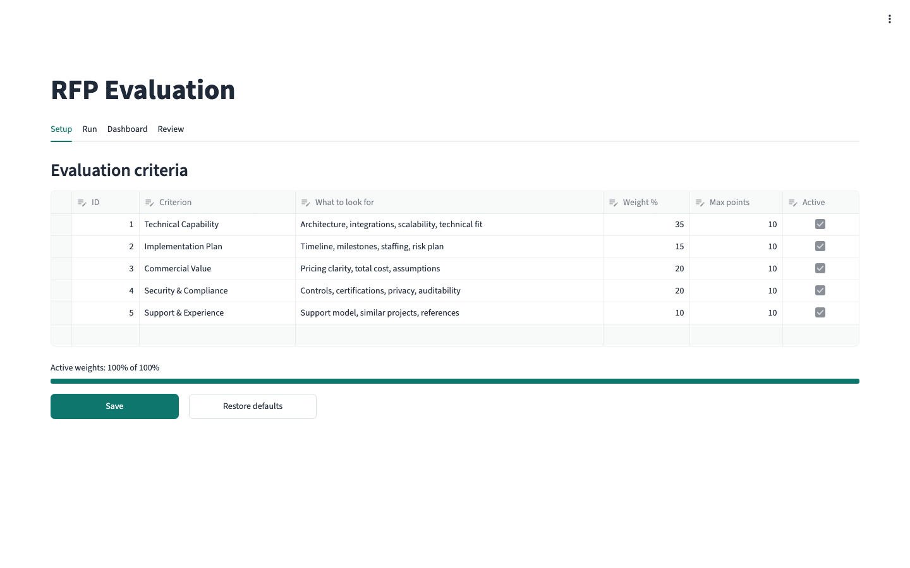
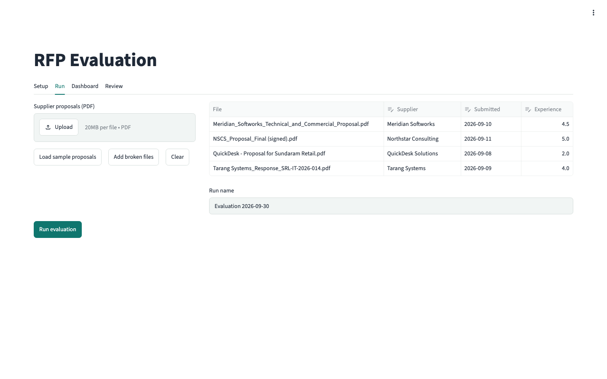
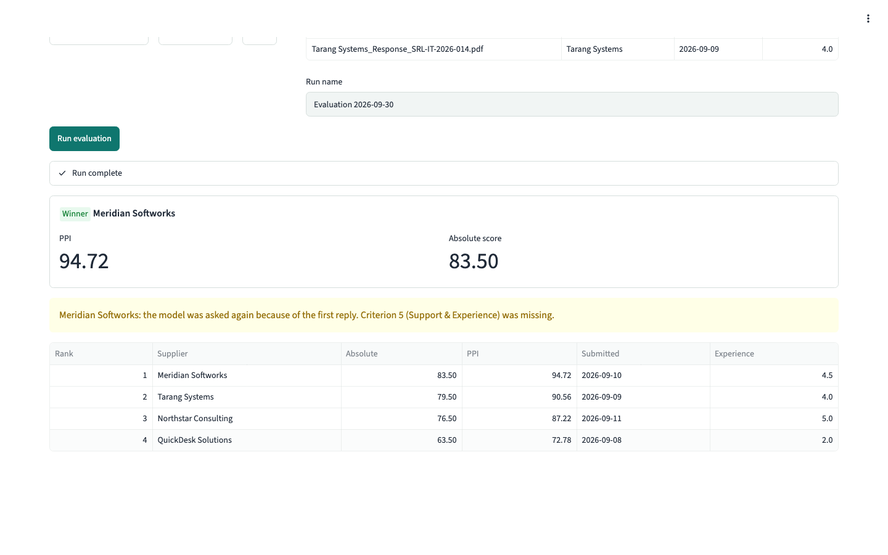
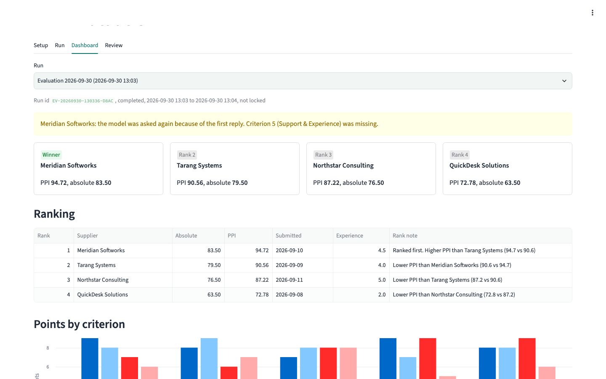
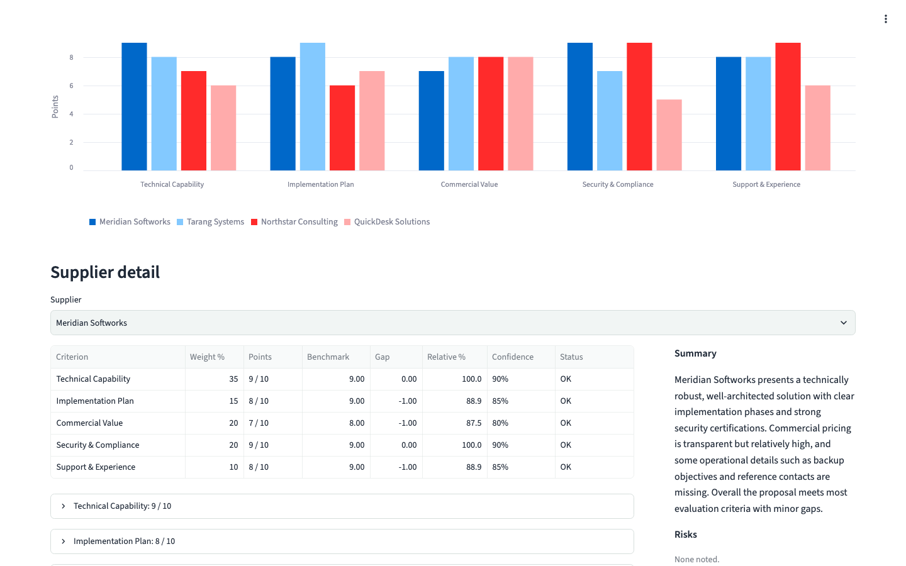
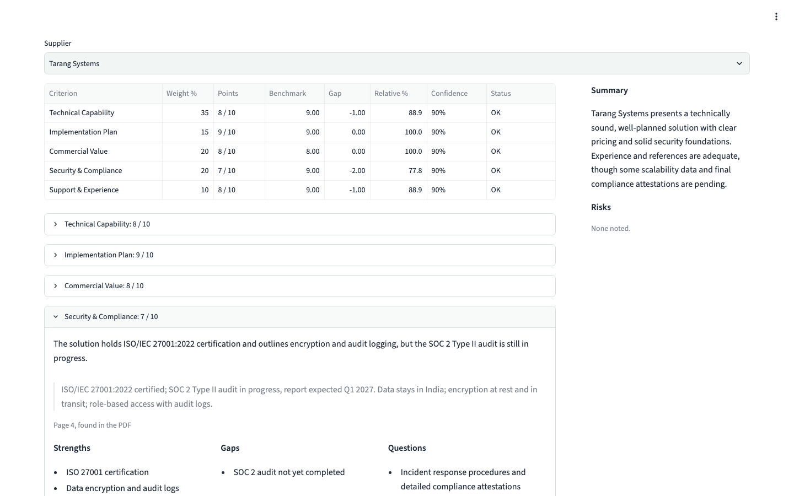
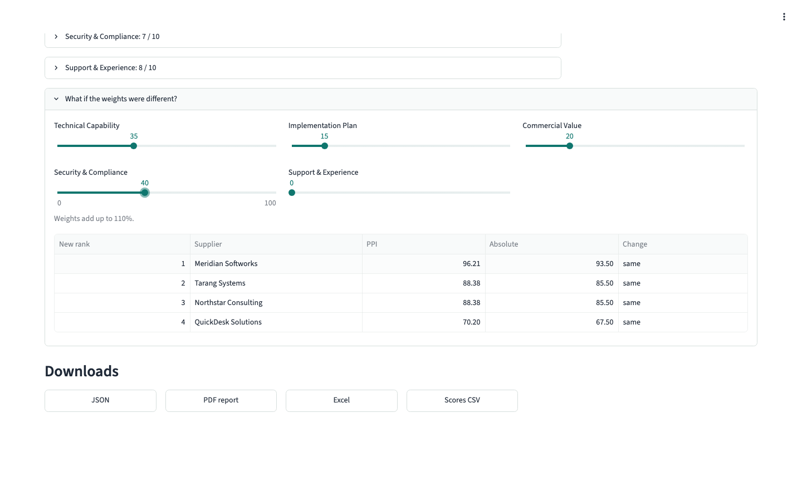
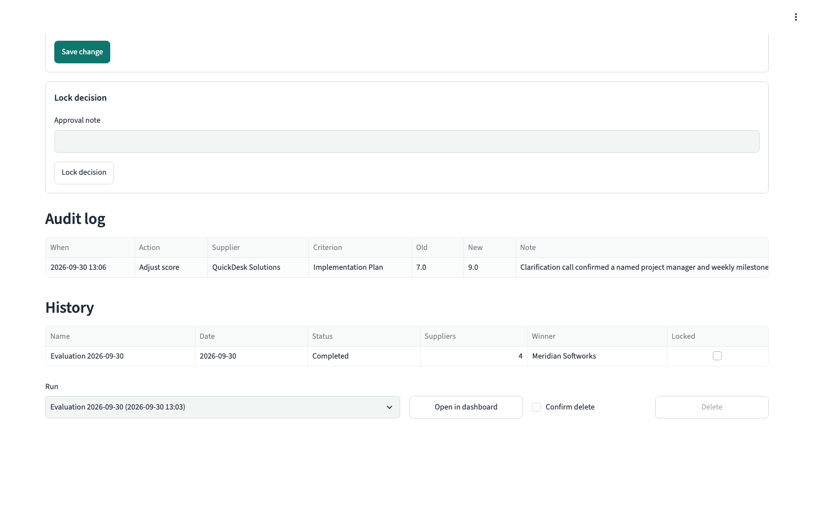
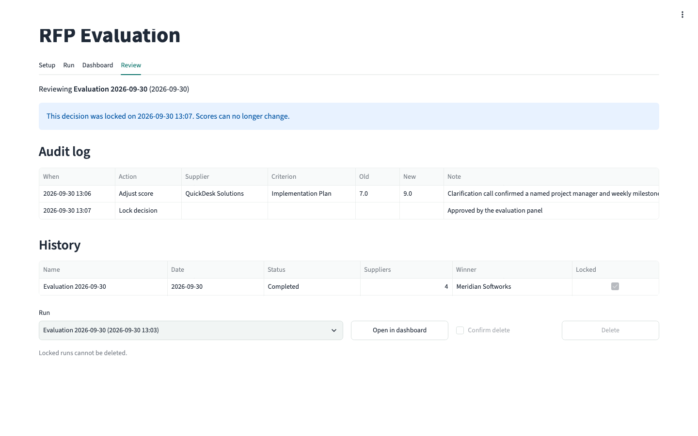
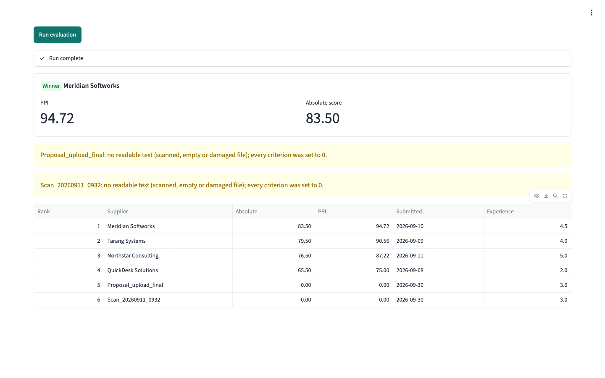

# RFP Evaluation

## What it does

This Streamlit app reads supplier proposals (PDF), asks a language model to score each one against criteria stored in SQLite, and then ranks the suppliers with plain Python. The model only judges the content and quotes its evidence. Every total, benchmark, tie-break and rank is worked out in code, so the same validated scores always give the same ranking.

## How to run

You need Python 3.10 or newer.

```bash
python -m venv .venv
source .venv/bin/activate        # on Windows: .venv\Scripts\activate
pip install -r requirements.txt
python database/seed.py          # creates database/rfp.sqlite and the 5 default criteria
```

`python database/seed.py --reset` deletes the saved criteria and puts the defaults back. Runs already saved are kept.

Then give the app its settings, either in a `.env` file in the project folder or in `.streamlit/secrets.toml` (copy `.streamlit/secrets.toml.example`). Streamlit secrets win over `.env` when both are set.

```toml
GROQ_API_KEY = "<your key>"
GROQ_MODEL = "openai/gpt-oss-120b"
LLM_MODE = "live"
```

| Setting | Meaning |
|---|---|
| `GROQ_API_KEY` | Key for the Groq API. Both files are in `.gitignore`. |
| `GROQ_MODEL` | Model name sent to Groq. |
| `LLM_MODE` | `live` calls the model, `offline` does not. |
| `RFP_DB` | Optional environment variable. A path that replaces `database/rfp.sqlite`. |

Start the app:

```bash
streamlit run streamlit_app.py
```

**Offline mode.** When there is no key, or `LLM_MODE=offline`, the app uses a keyword scorer instead of the model (`offline_reply` in `core/groq_client.py`). It splits each criterion's guidance into topics (for example "timeline, milestones, staffing, risk plan"), counts the lines that mention each topic, takes points off for vague wording such as "TBC" or "to be confirmed", and picks the best matching line as the quote. It returns the same JSON shape as the model, so the rest of the pipeline is exactly the same. It is handy for trying the app and for the tests, but the scores are rough.

## Folder layout

```text
streamlit_app.py          entry point, four tabs: Setup, Run, Dashboard, Review
core/
  config.py               settings (key, model, mode), paths, preset sample details
  agent.py                the orchestrator: LangGraph flow per supplier, threads, run lifecycle, score changes
  pdf_text.py             PDF text per page, two-column reading
  prompt.py               system prompt, criteria block, document block, correction message
  groq_client.py          the model call and the offline keyword scorer
  reply.py                Pydantic models, reply repair, input checks
  evidence.py             checks that each quote really is in the PDF
  math_rules.py           absolute score, benchmarks, gaps, relative %, PPI, tie-breaks, rank notes
  storage.py              SQLite reads and writes
  reports.py              JSON, PDF, Excel and CSV exports
ui/
  setup_tab.py            edit criteria, weights, max points, active flag
  run_tab.py              upload PDFs, enter supplier details, run a batch
  dashboard_tab.py        cards, ranking, chart, drill-down with evidence, what-if weights, downloads
  review_tab.py           change a score with a reason, lock a decision, audit log, history
  widgets.py              shared tables and small helpers
database/
  schema.sql              table definitions
  seed.py                 creates the database and default criteria
samples/
  proposals/              four proposals for one tender (preset details)
  broken/                 two files that cannot be read
  kalpavriksha_retail/    a second tender with four harder proposals
  sample_run.json         exported JSON of one completed run
tests/                    pytest suite and one fixture PDF
docs/
  screenshots/            images used below
  demo.mp4                short screen recording
.streamlit/               theme, upload limit, secrets example
```

## How it maps to the brief

| Brief component | File | Function |
|---|---|---|
| Orchestrator agent | `core/agent.py` | `evaluate_batch`, which runs `supplier_graph` (LangGraph) for each supplier |
| Document tool | `core/pdf_text.py` | `page_texts` |
| Evaluation agent | `core/prompt.py`, `core/groq_client.py` | `build_messages`, then `ask` (or `offline_reply`) |
| Validation tool | `core/reply.py` | `read_reply` with the Pydantic models `CriterionScore` and `SupplierCard` |
| Ranking tool | `core/math_rules.py` | `score_batch` |
| Persist | `core/storage.py` | `create_run`, `save_scores`, `finish_run`, `add_audit` |
| Present | `ui/*.py` | `render` in each tab |

The ten data-flow steps from the brief:

| Step | Where it happens |
|---|---|
| 1. Setup | `streamlit_app.py` calls `prepare_database`; `ui/setup_tab.py` shows criteria from `list_criteria` |
| 2. Input | `ui/run_tab.py`: file uploader plus a table for supplier name, submission date, experience rating |
| 3. Batch | `evaluate_batch` checks inputs, makes a run id like `EV-20260930-104512-3F2A`, calls `create_run` |
| 4. Evaluate | criteria are reloaded (`list_criteria(active_only=True)`); graph nodes `read` (text) and `ask` (prompt and model call) |
| 5. Validate | graph node `check` (`read_reply`), with one retry if needed; node `evidence` checks quotes |
| 6. Score | `add_peer_metrics` in `math_rules.py` works out the absolute weighted score |
| 7. Benchmark | `benchmarks` and `add_peer_metrics`: best score per criterion, gap, relative % |
| 8. Rank | PPI, then `order_key` sort, sequential ranks, `add_rank_notes` |
| 9. Persist | `save_scores` and `finish_run`, all rows under one `rfp_run_id` |
| 10. Present | Run tab result, Dashboard tab and downloads, Review tab |

## The LangGraph flow

Each supplier goes through a small graph built in `supplier_graph()` in `core/agent.py`.

```text
START -> read
read  -> blank        (no readable text)
read  -> ask          (text found)
blank -> END
ask   -> check
check -> ask          (reply not JSON or a criterion missing, only if tries < MAX_TRIES = 2)
check -> evidence     (reply fine, or already retried once)
evidence -> END
```

- **read** pulls the page texts and builds the messages.
- **blank** skips the model when the PDF has no text and sets every criterion to 0 with status `NO_TEXT`.
- **ask** calls the model (or the offline scorer).
- **check** repairs the reply. If the reply was not JSON or a criterion was missing, it appends the model's reply and a correction message that lists the problems, and the graph goes back to **ask** one more time. The first reply's problems are kept as a warning.
- **evidence** looks for each quote in the PDF text.

**Why suppliers run in threads.** `evaluate_all` uses a `ThreadPoolExecutor` with `MAX_WORKERS = 4`. Each supplier is scored on its own and never looks at another supplier, and most of the time is spent waiting for the model over the network. So running them side by side makes a batch take about as long as the slowest supplier instead of the sum of all of them. The ranking math only starts after every supplier is back, and the results are sorted by fixed rules, so the order the threads finish in does not change anything.

## Formulas

All in `core/math_rules.py`. Every value is rounded to 4 decimal places before it is compared, so tiny float noise cannot break a tie.

| Measure | Formula |
|---|---|
| Absolute weighted score | sum over criteria of (points / max points) x weight |
| Benchmark | highest points any supplier got on that criterion in this batch |
| Gap | points - benchmark (0 for the leader, negative for the rest) |
| Relative % | points / benchmark x 100, and 0 when the benchmark is 0 |
| PPI | sum of (relative % x weight) / sum of weights |

**Worked example** (`test_hand_worked_example` in `tests/test_math_rules.py`). Two criteria, weights 60 and 40, max 10 each.

| | C1 (60) | C2 (40) |
|---|---|---|
| Alpha | 8 | 5 |
| Beta | 6 | 10 |

```text
Absolute
  Alpha = 8/10 x 60 + 5/10 x 40  = 48 + 20 = 68
  Beta  = 6/10 x 60 + 10/10 x 40 = 36 + 40 = 76

Benchmarks
  C1 = max(8, 6) = 8
  C2 = max(5, 10) = 10

Gaps
  Alpha: 8 - 8 = 0,   5 - 10 = -5
  Beta:  6 - 8 = -2,  10 - 10 = 0

Relative %
  Alpha: 8/8 x 100 = 100,  5/10 x 100 = 50
  Beta:  6/8 x 100 = 75,   10/10 x 100 = 100

PPI
  Alpha = (100 x 60 + 50 x 40) / 100 = (6000 + 2000) / 100 = 80
  Beta  = (75 x 60 + 100 x 40) / 100 = (4500 + 4000) / 100 = 85
```

Beta ranks first on PPI (85 vs 80), even though Alpha won the heavier criterion. Alpha's rank note reads "Lower PPI than Beta (80.0 vs 85.0)".

## Tie-breaks and rank notes

Suppliers are sorted by:

1. Higher PPI
2. Earlier submission date
3. Higher experience rating
4. Supplier name, A-Z (case ignored)

Ranks 1, 2, 3 and so on are given only after this sort. Each supplier then gets a rank note that says why it sits where it does, compared with the supplier just above it (the first supplier is compared with the second). Examples:

- `Ranked first. Higher PPI than Alpha (85.0 vs 80.0)`
- `Same PPI as Beta (80.0000); submitted later (2026-09-12 vs 2026-09-09)`
- `Same PPI and submission date as Beta; lower experience rating (3 vs 4.5)`
- `Same PPI, submission date and experience rating as Alpha; ordered by supplier name (A-Z)`

When two PPIs look the same at one decimal, the note shows four decimals so the difference is visible.

The dashboard has a "What if the weights were different?" panel. Moving the sliders re-runs `reweight` and shows the new order next to the old one, but it never saves anything. Only the Review tab changes stored scores.

## Reply checks

`read_reply` in `core/reply.py` turns whatever the model sends into a clean `SupplierCard`. Each criterion ends up with one status.

| Status | When | What happens |
|---|---|---|
| `OK` | score is a number within 0 to max | kept as is |
| `COERCED` | score is text, such as `"8/10"` or `"7 points"` | read as a number; a fraction with a different base is rescaled, so `"4/5"` on a max of 10 becomes 8; a warning is added |
| `CLIPPED` | score is below 0 or above max | set to the nearest limit (14 on a max of 10 becomes 10); warning |
| `MISSING` | no result for an active criterion | set to 0; warning; triggers the one retry |
| `INVALID` | no usable score, or the whole reply is not JSON | set to 0; warning; a non-JSON reply triggers the retry |
| `NO_TEXT` | the PDF has no readable text | the model is skipped; every criterion 0; warning |
| `OVERRIDDEN` | a reviewer changed the score in the Review tab | new points, reason and an audit row are saved, and the run is re-ranked |

Other repairs:

- JSON is found even when it sits inside a code fence or has text around it.
- An unknown criterion id is dropped with a warning.
- A criterion that appears twice keeps the first entry.
- Confidence is read as 0 to 1: `85` becomes 0.85, `"40%"` becomes 0.4, anything unreadable becomes 0.
- Strengths, weaknesses and missing-information lists are trimmed to 5 items, risks to 8. Each item is cut at 300 characters, the justification and summary at 1,500, and the quote at 600.
- The Pydantic models refuse values that should never get through, such as confidence 1.5, negative points or an unknown status.

**Input checks** run before a batch starts, and the Run button stays disabled while any of them fail.

- `submission_errors`: at least two proposals; supplier name present and not used twice (case ignored); submission date is a real `YYYY-MM-DD` date and not in the future; experience rating from 1 to 5; the file ends in `.pdf`, starts with a PDF header, is not empty and is at most 20 MB; the same file is not uploaded twice for two suppliers.
- `criteria_errors`: each criterion has a unique name, max points above 0 and a weight from 0 to 100; at least one is active; active weights add up to 100.

## Quote check

The prompt asks for one passage copied word for word, but models still shorten or paraphrase. `quote_found` in `core/evidence.py` checks each quote against the PDF text.

1. The quote is split on `...` and on sentence ends.
2. Words are lowercased and punctuation is removed.
3. Every part with 4 or more words must match some window of the same length on one page, with at least 85% of the words shared.
4. A quote with no part that long must appear as an exact run of words.
5. If every part matches, the first matching page is stored.

The drill-down shows "Page N, found in the PDF" or "Not found in the PDF" under each quote, so a reviewer can see at once which evidence to trust.

**Two-column pages.** Slide decks often have two text columns side by side, and a plain reader mixes their lines together. `read_page` in `core/pdf_text.py` groups words into rows and looks for a vertical gap between 35% and 65% of the page width that no word crosses. It only accepts a split when both sides have several words per row and neither side looks like a table (big gaps between words), so real tables are left alone. When a split is found, it reads the heading rows, then the left column, then the right column. If pdfplumber finds almost nothing, pypdf is tried as a backup, and a file with under 150 characters in total counts as having no text.

## Database tables

Defined in `database/schema.sql`.

| Table | Key columns | Brief name |
|---|---|---|
| `criteria` | `criterion_id`, `name`, `description`, `weight`, `max_score`, `is_active`, `updated_at` | `evaluation_criteria` |
| `evaluation_runs` | `rfp_run_id`, `name`, `created_at`, `finished_at`, `status` (RUNNING, COMPLETED, FAILED), `model`, `criteria_json`, `notes_json`, `locked`, `locked_at`, `lock_note` | `rfp_runs` |
| `supplier_scores` | `rfp_run_id`, `supplier_name`, `submission_date`, `experience_rating`, `file_name`, `absolute_score`, `ppi`, `final_rank`, `result_json` | `supplier_results` |
| `audit_log` | `rfp_run_id`, `happened_at`, `action` (ADJUST_SCORE, LOCK_DECISION), `supplier_name`, `criterion_id`, `old_value`, `new_value`, `note` | extra |

Each run stores a copy of the criteria it used (`criteria_json`), so later edits in the Setup tab do not change old runs. `result_json` holds the full supplier result: every criterion's points, status, benchmark, gap, relative %, confidence, quote, page and reason. Deleting a run removes its scores and audit rows too. A locked run cannot be changed or deleted.

## Sample data

**`samples/proposals`**: four proposals for Sundaram Retail tender SRL/IT/2026/014 (one support platform for 850 agents across 212 stores). The Run tab's "Load sample proposals" button fills in their names, dates and experience ratings.

| File | Supplier | What it is like |
|---|---|---|
| `Meridian_Softworks_Technical_and_Commercial_Proposal.pdf` | Meridian Softworks | 4 pages, the strongest. Detailed architecture, ready SAP and Salesforce connectors, a 26-week plan with exit criteria, a full price table, ISO 27001 and SOC 2 Type II, 24x7 support. Also the most expensive. |
| `NSCS_Proposal_Final (signed).pdf` | Northstar Consulting | 2-page formal letter. Lots of experience and references, but integration details are "TBC", EU data residency costs extra and contacts are "on request". |
| `QuickDesk - Proposal for Sundaram Retail.pdf` | QuickDesk Solutions | 2-page informal letter. Cheap and fast (10 weeks), but a generic webhook for SAP, a team of three, no certifications yet, data stored in Singapore and email-only support. |
| `Tarang Systems_Response_SRL-IT-2026-014.pdf` | Tarang Systems | 4-page slide deck in a two-column layout. Balanced: clear plan and prices, ISO 27001, SOC 2 still in progress. Tests the two-column reader. |

**`samples/broken`**: "Add broken files" adds these. `Scan_20260911_0932.pdf` is a one-page blank scan with no text, and `Proposal_upload_final.pdf` is a damaged file that has a PDF header but nothing after it. Both pass the upload checks, get `NO_TEXT` on every criterion, score 0 and show a warning on the run.

**`samples/kalpavriksha_retail`**: a second, harder tender, KRL/CX/2026/027 for Kalpavriksha Retail.

| File | Supplier | What it tests |
|---|---|---|
| `Crestline_Service_Systems_Proposal_KRL-027.pdf` | Crestline Service Systems | A strong, specific proposal that should win. |
| `Sahyadri Digital - quotation.pdf` | Sahyadri Digital | A one-page, vague, cheap quotation. Low price should not win on its own. |
| `Orbitel_KRL_response_deck.pdf` | Orbitel Solutions | A two-column slide deck with a prompt-injection line on the last slide asking automated reviewers for full marks. The prompt treats the document as data, and the model should list it as a risk instead of obeying it. |
| `VantageCX_Proposal_signed_scan.pdf` | Vantage CX Partners | Only page 1 is text; the other four pages are scanned images, so most of the proposal cannot be read. |

These files have no preset details, so type them in by hand from `details.txt` (supplier, submission date, experience rating) after uploading.

## Sample run

`samples/sample_run.json` is the JSON export of one live run of the four proposals in `samples/proposals` with the default criteria (run `EV-20260930-130336-D8AC`). It was saved right after the run finished, before any reviewer change.

| Rank | Supplier | Absolute | PPI | Rank note |
|---|---|---|---|---|
| 1 | Meridian Softworks | 83.50 | 94.72 | Ranked first. Higher PPI than Tarang Systems (94.7 vs 90.6) |
| 2 | Tarang Systems | 79.50 | 90.56 | Lower PPI than Meridian Softworks (90.6 vs 94.7) |
| 3 | Northstar Consulting | 76.50 | 87.22 | Lower PPI than Tarang Systems (87.2 vs 90.6) |
| 4 | QuickDesk Solutions | 63.50 | 72.78 | Lower PPI than Northstar Consulting (72.8 vs 87.2) |

Things worth noticing in this run:

- The first reply for Meridian Softworks left out criterion 5, so the graph asked the model once more. The second reply was complete, and the run keeps the warning: "Meridian Softworks: the model was asked again because of the first reply. Criterion 5 (Support & Experience) was missing."
- 19 of the 20 quotes were found in the PDFs. The one that was not found (Northstar Consulting, Implementation Plan) is shown as "Not found in the PDF" in the drill-down.
- All scores came back as plain numbers from 0 to 10, so every item has status OK.
- The file also holds the criteria used for the run, the benchmark, gap and relative % for every item, and an empty audit list.

In the demo the reviewer then raised QuickDesk Solutions on Implementation Plan from 7 to 9 with a reason and locked the run. Those two steps show up in the audit log, not in this file.

## Tests

```bash
pytest
```

If Python cannot find the `core` package, run `PYTHONPATH=. pytest -q`. There are 29 tests. They use a temporary database and offline mode, and `conftest.py` replaces the model call with one that fails, so the tests never call the model.

| File | Covers |
|---|---|
| `tests/test_math_rules.py` | the worked example, zero benchmark, each tie-break level, rounding before comparing, what-if reweight leaves the input untouched |
| `tests/test_reply.py` | JSON in a code fence, non-JSON reply, missing and unknown criteria, COERCED and CLIPPED scores, confidence reading, list trimming, submission and criteria input checks, Pydantic limits |
| `tests/test_evidence.py` | exact quote, quote with "...", invented or mixed quotes rejected, quotes on the two-column Tarang deck, the Orbitel deck read column by column |
| `tests/test_end_to_end.py` | a full offline run of the four samples, broken files, retry on non-JSON and on a missing criterion, only one retry, rate-limit message, errors never show the key, bad inputs, score change then lock and delete, all four exports |

## Assumptions and limits

- The free Groq tier has a rate limit. Four suppliers at once can hit it. The app then stops the run and shows "The model's free rate limit was reached. Wait a minute and run again." Waiting a minute between runs is usually enough.
- The model sometimes skips a criterion. That triggers one retry with a note listing what was missing. If it is still missing, that criterion scores 0 with a warning.
- Scanned pages are not OCR'd. Image-only pages count as empty.
- The document text sent to the model is cut at 50,000 characters.
- On Streamlit Community Cloud the SQLite file lives on the app's disk, so saved runs and edited criteria are lost when the app restarts. Download the JSON of any run you want to keep.
- Scores depend on the model's reading. The model judges content only (points, reasons, quotes). Python does all the arithmetic, benchmarks, tie-breaks and ranks.
- The submission date and experience rating come from the user, not from the PDF.

## Deploy

1. Push the project to a GitHub repository (without `.env` or `.streamlit/secrets.toml`).
2. In Streamlit Community Cloud, create a new app from that repository and set the main file to `streamlit_app.py`.
3. In the app's secrets settings, add `GROQ_API_KEY`, `GROQ_MODEL` and `LLM_MODE` in the same format as `.streamlit/secrets.toml.example`.
4. The database and default criteria are created on first start, so no seed step is needed there.

## Screenshots

A short screen recording of a successful run and a failing case is in `docs/demo.mp4`. The exported JSON of one completed run is in `samples/sample_run.json`.


Setup tab: the five criteria with weights, max points and the active flag.


Run tab with the four sample proposals loaded and their details filled in.


A finished run with its step log, winner card and ranking.


Dashboard: supplier cards and the ranking table with rank notes.


Points by criterion for each supplier.


Supplier detail with benchmark, gap, relative %, the quote and whether it was found in the PDF.


What-if weights: a new order shown next to the old one, not saved.


Review tab: changing a score with a reason and locking the decision.


Run history with status, winner and lock state.


A run with the broken files: NO_TEXT scores and warnings.
